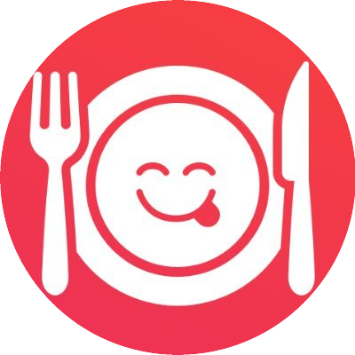
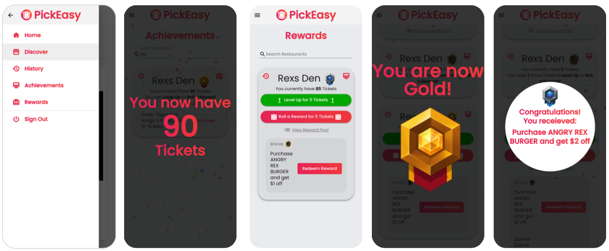

  

<h1 align="center">
  <a href="https://pick-easy.pravinthan.com">PickEasy</a>
</h1>

> A web app that allows restaurants to create an achievement-based, gamified loyalty and rewards system for their customers.

> This project won **1st place** as the **best project** in a course-wide competition (2020 Summer _Introduction to Software Engineering_).

<h2>Table of Contents</h2>

- [Demo](#demo)
- [Features](#features)
- [Screenshots](#screenshots)
- [Contributors](#contributors)
- [License](#license)

## Demo

## Features

- Mobile-friendly and simple UI
- Gamified and intuitive UX

**As a _restaurant_:**

- Configure gamified Achievements and Rewards that are tailored to your customer.
- Scan Achievement and Reward QR Codes to allow customer to keep track of progress.

**As a _customer_:**

- Discover any of your favourite restaurants and check out its Achievements and Rewards.
- Activate and present Achievement QR Codes to restaurants to earn progression and Tickets.
- Spend Tickets to Level Up (Bronze - Diamond) to unlock better rewards.
- Spend Tickets to Roll a Random Reward based on your level.

## Screenshots

## Contributors

This project was made in collaboration with [Luke Zhang](https://github.com/Smawllie), [Evan Ng](https://github.com/Evan8456), [Anthony Alaimo](https://github.com/AnthonyAlaimo), [Jeremy (Chi Jian) Hsu](https://github.com/Jer3myHsu)

## License

[MIT](./LICENSE) &copy; [Pravinthan Prabagaran](https://pravinthan.com).

[MIT](./LICENSE) &copy; [Luke Zhang](https://github.com/Smawllie).

[MIT](./LICENSE) &copy; [Evan Ng](https://github.com/Evan8456).

[MIT](./LICENSE) &copy; [Anthony Alaimo](https://github.com/AnthonyAlaimo).

[MIT](./LICENSE) &copy; [Jeremy (Chi Jian) Hsu](https://github.com/Jer3myHsu).
